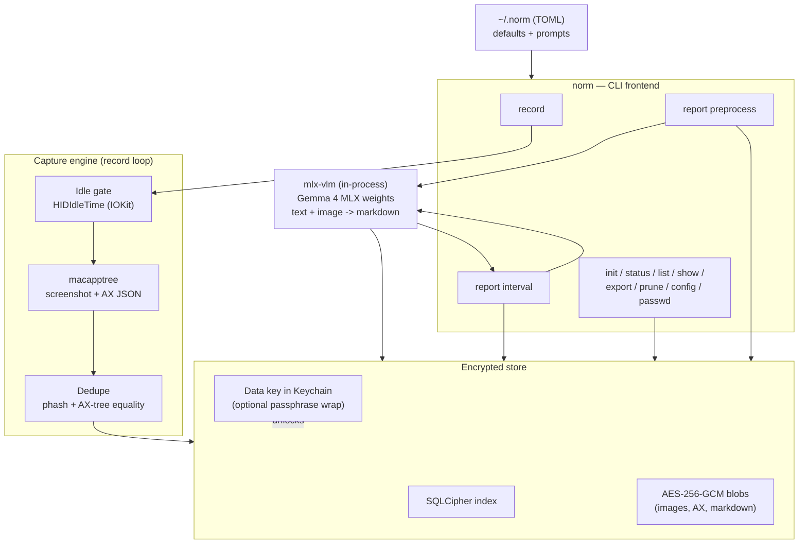

# norm — Concept Document

## 1. Purpose

`norm` is a macOS CLI that periodically captures a screenshot plus the active screen's
accessibility (AX) tree, stores both encrypted on disk, and runs a local multimodal model
(Gemma 4, MLX, in-process) over the capture history to emit markdown activity summaries.
Two report phases: per sliding window (`report preprocess`) and per time interval
(`report interval`).

## 2. Rationale

- AX tree + pixels: AX provides structured, cheap, searchable text; pixels are required for
  apps that render to a canvas (terminals, design tools, video). Both are captured; both are
  sent to the model.
- Idle gate + content dedupe: frames are not stored when the user is absent or the screen is
  unchanged. Bounds store growth and inference cost.
- In-process inference: no network, no daemon, no localhost server. The model runs inside the
  norm process via `mlx-vlm`.
- Application-level encryption: data access is gated on a norm-specific key, independent of
  the login password and of FileVault.

## 3. Use cases

- Activity summary over a time range (input to standups/reviews).
- Reconstruction of past on-screen context.
- Passive time accounting without manual entry.
- Workflow/SOP extraction from captured sessions.

## 4. Architecture



Components:

- CLI frontend (`norm`): argument parsing, config resolution (CLI flag > `~/.norm` >
  built-in default), dispatch, unified exit codes.
- Capture engine (`record`): timed loop — idle gate, macapptree capture, dedupe, encrypted
  write.
- Encrypted store: SQLCipher index + AES-256-GCM blob files; data key in Keychain, optionally
  passphrase-wrapped.
- Inference (`mlx-vlm`, in-process): loads Gemma 4 MLX weights; `generate()` with image + text.
- Report engine: `report preprocess` (sliding window), `report interval` (aggregation).
- Config: `~/.norm` (TOML): default parameters and the two prompts.

### Dependencies

norm is a Python CLI; both the capture and inference layers are Python libraries. External
surface:

- macapptree — third-party macOS library that captures a screenshot of the visible apps and
  emits their accessibility tree as JSON with element bounding boxes; the source of each
  frame's image + AX data.
- mlx-vlm — in-process MLX inference for vision-language models on Apple Silicon (loads the
  Gemma 4 weights).
- imagehash (dHash) — perceptual hashing for content dedupe.
- SQLCipher (encrypted SQLite index) + AES-256-GCM (blob encryption) + Argon2id (passphrase
  wrapping).
- IOKit `HIDIdleTime` — user-idle detection.

## 5. Inference layer

- Library: `mlx-vlm`, run in-process on Apple Silicon (MLX). No server, no daemon, no socket;
  norm does not start or connect to any inference endpoint.
- Model: an MLX repo id or local path. Default `mlx-community/gemma-4-e4b-it-4bit`. First load
  downloads weights to the Hugging Face cache (`~/.cache/huggingface`); later loads are local.
- Call pattern:
  `model, processor = load(model_ref)` →
  `prompt = apply_chat_template(processor, model.config, text, num_images=n)` →
  `generate(model, processor, prompt, image=[...])`.
- Decrypted frames are passed to `generate()` as in-memory PIL images and AX text as string;
  no plaintext image or AX dump is written to disk at report time.
- Modalities used: text + image. (Gemma 4 also supports audio; not used.)

## 6. Data model

- capture: `id`, `ts`, `active_app`, `idle_gap_s`, `phash`, `ax_hash`, `image_ref`, `ax_ref`,
  `duration_s` (extended when later frames dedupe to it).
- preprocess: `id`, `window_start`, `window_end`, `capture_ids[]`, `model`, `prompt_id`,
  `markdown_ref`.
- interval report: produced on demand from preprocess records; written to file or stdout; not
  stored by default.

Blob refs point to encrypted files under `data_dir`; the index is an encrypted SQLCipher
database in the same directory.

## 7. Security model

- FileVault is volume-level full-disk encryption unlocked at login. It has no per-directory or
  per-process scope and is not norm's access gate. It remains compatible as at-rest defense.
- At rest: SQLCipher (AES-256) index; AES-256-GCM blobs.
- Key custody: random 256-bit data key as a dedicated Keychain item (ACL scoped to the norm
  binary), optionally wrapped by a norm passphrase via Argon2id. The login password is never
  read or stored.
- No elevation: runs as the user; no sudo, no setuid, no privileged helper.
- Any read or write of data requires a successful unlock. The key is resident in process
  memory only for the duration of a command and is zeroed on exit. No long-lived mounted
  volume exists.
- Report-time decryption is transient: blobs are decrypted to in-memory PIL images/strings,
  passed to `mlx-vlm`, and discarded; no plaintext is written to disk.
- Capture requires macOS Accessibility and Screen Recording permissions; missing permissions
  fail fast (exit 6).
- norm must run non-sandboxed: reading other applications' AX trees is not permitted from
  inside the macOS App Sandbox.

## 8. Capture gating (idle + dedupe)

- Idle gate: read `HIDIdleTime` (seconds since last HID input) via IOKit. If
  `idle >= idle_threshold`, skip the capture; record the elapsed idle as `idle_gap_s` on the
  next stored capture.
- Content dedupe: if the new frame's perceptual hash is within `phash_threshold` (Hamming
  distance) of the last stored frame AND `ax_hash` is identical, do not store; extend the prior
  record's `duration_s`.
- Net rule: store a capture iff the user is present AND the screen changed.

## 9. Reporting pipeline

- `report preprocess`: slide a window of `K` captures with stride `J` over the ordered capture
  history; per window, call `generate(prompt_preprocess, images + AX text)` in-process and store
  one markdown summary per window. Idempotent unless `--force`.
- `report interval`: gather per-window markdown summaries within `[from, to]`; call
  `generate(prompt_interval, markdowns)` and emit aggregated markdown. Errors (exit 5) if no
  preprocess output covers the interval, unless `--auto-preprocess`.

## 10. Worked examples

State tags: `FS` filesystem, `IDX` SQLCipher index rows, `KC` Keychain, `LD` launchd,
`PROC` process, `HF` Hugging Face weight cache, `OUT` stdout/stderr, `EXIT` exit code.
`data_dir` default = `~/Library/Application Support/norm`.

### 10.1 init
```
$ norm init
before  FS: no ~/.norm; no data_dir          KC: no norm key
action  write config; create store; mint key
after   FS: ~/.norm (TOML, all default keys); data_dir/index.db (SQLCipher header);
            data_dir/blobs/ (empty)
        KC: item "norm:datakey" (random 256-bit, ACL=norm binary)
        OUT(stdout): config path + data_dir path     EXIT: 0
```

### 10.2 init over an existing store
```
$ norm init
before  FS: data_dir/index.db exists
action  none (refuses to clobber)
after   FS: unchanged
        OUT(stderr): "store already initialized; use --force"   EXIT: 2
```

### 10.3 record --once, user present and screen changed
```
$ norm record --once
before  IDX: last capture C(n) at T0, phash=H0, ax_hash=A0
        state: HIDIdleTime < idle_threshold; current frame phash=H1 (|H1-H0|>thresh) or A1!=A0
action  unlock store; capture via macapptree; hash; not a dup -> store
after   IDX: + capture C(n+1) {ts=now, active_app, idle_gap_s=0, phash=H1, ax_hash=A1,
              image_ref, ax_ref, duration_s=interval}
        FS: + 2 encrypted blobs in data_dir/blobs/ (image, AX)
        OUT: capture id     EXIT: 0
```

### 10.4 record --once, user idle
```
$ norm record --once --idle-threshold 60
before  state: HIDIdleTime = 180s (>= 60)
action  unlock store; read idle; skip capture; buffer idle gap
after   IDX: no new capture row; pending idle_gap = 180 (applied to next stored capture)
        FS: no new blobs
        OUT: "idle 180s; skipped"     EXIT: 0
```

### 10.5 record --once, screen unchanged (dedupe)
```
$ norm record --once
before  IDX: last capture C(n), phash=H0, ax_hash=A0, duration_s=300
        state: current frame phash=H0' (|H0'-H0|<=thresh) AND ax_hash=A0
action  capture; hash; dup (both match) -> do not store; extend prior
after   IDX: C(n).duration_s = 300 + interval; no new row
        FS: no new blobs
        OUT: "duplicate; extended C(n)"     EXIT: 0
```

### 10.6 record (persistent loop)
```
$ norm record --interval 5
before  PROC: none
action  foreground loop; every ~5 min run the gate+capture path (10.3/10.4/10.5)
after   PROC: norm runs until SIGINT/SIGTERM
        on signal: flush writes, lock store, zero key in memory   EXIT: 0
```

### 10.7 record daemon lifecycle
```
$ norm record --install
before  LD: no agent
action  write ~/Library/LaunchAgents/<label>.plist; bootstrap; start
after   LD: agent loaded and running (no sudo)     OUT: label     EXIT: 0

$ norm record --status
after   OUT: running=true pid=<n>     EXIT: 0

$ norm record --stop
after   LD: agent stopped; subsequent --status -> running=false     EXIT: 0
```

### 10.8 report preprocess
```
$ norm report preprocess --window 6 --stride 3
before  IDX: N=12 captures; 0 preprocess rows; HF: weights cached
action  unlock; windows = floor((12-6)/3)+1 = 3; per window decrypt frames to in-memory
        PIL + AX text; load() once; generate(prompt_preprocess, image+AX); store markdown
after   IDX: + 3 preprocess rows {window_start/end, capture_ids[6], model, prompt_id,
              markdown_ref}
        FS: + 3 encrypted markdown blobs
        OUT: "3 windows summarized"     EXIT: 0
note    no socket opened; inference in-process via mlx-vlm
```

### 10.9 report preprocess (re-run, idempotent)
```
$ norm report preprocess --window 6 --stride 3
before  IDX: same 12 captures; 3 preprocess rows already cover them
action  detect covered windows; skip
after   IDX: unchanged (no duplicates)     OUT: "0 new windows"     EXIT: 0
        (with --force: recompute and overwrite the 3 rows)
```

### 10.10 report interval, no preprocess coverage
```
$ norm report interval --last 24h
before  IDX: captures exist in range; preprocess rows do NOT cover range
action  none
after   OUT(stderr): "no preprocess output for range; run report preprocess or pass
        --auto-preprocess"     EXIT: 5
```

### 10.11 report interval, normal
```
$ norm report interval --from -24h --to now
before  IDX: preprocess rows P1..Pk within [from,to]
action  unlock; decrypt P1..Pk markdown; load(); generate(prompt_interval, markdowns)
after   IDX: unchanged (interval reports not stored by default)
        OUT(stdout): aggregated markdown     EXIT: 0
```

### 10.12 report interval --auto-preprocess
```
$ norm report interval --last 24h --auto-preprocess
before  IDX: captures in range; missing preprocess coverage
action  run preprocess for uncovered windows (10.8), then aggregate (10.11)
after   IDX: + new preprocess rows
        OUT(stdout): aggregated markdown     EXIT: 0
```

### 10.13 list
```
$ norm list --from -6h --to now --json
before  IDX: M captures in range
action  unlock; read index metadata only (no blob decrypt)
after   FS: unchanged
        OUT(stdout): JSON array [{id, ts, active_app, idle_gap_s, duration_s}, ...]   EXIT: 0
```

### 10.14 show --export
```
$ norm show 1042 --export ./out
before  IDX: capture 1042 exists
action  unlock; decrypt image+AX of 1042; write decrypted copies under ./out
after   FS: + ./out/1042.png, ./out/1042.ax.json (plaintext, user-requested export)
        OUT(stdout): metadata of 1042     EXIT: 0
        (unknown id -> stderr "not found", EXIT: 5)
```

### 10.15 export (range)
```
$ norm export --from -1d --to now --out ./dump --include images,ax,reports
before  IDX: data in range
action  unlock; decrypt and write requested artifact types
after   FS: + ./dump/{images,ax,reports}/...  (plaintext export)     EXIT: 0
```

### 10.16 prune
```
$ norm prune --before -30d --dry-run
before  IDX: rows older than 30d exist
action  compute matches; report; delete nothing
after   FS/IDX: unchanged     OUT: count + ids that would be removed     EXIT: 0

$ norm prune --before -30d
action  delete matching index rows AND their blobs atomically
after   IDX: matching rows removed; FS: matching blobs removed (no orphans)   EXIT: 0
```

### 10.17 config set / get
```
$ norm config set interval_minutes 10
before  ~/.norm: interval_minutes = 5
after   ~/.norm: interval_minutes = 10 (valid TOML)     EXIT: 0

$ norm config get interval_minutes
after   OUT(stdout): 10     EXIT: 0

$ norm config set bogus 1
after   ~/.norm unchanged; OUT(stderr): "unknown key 'bogus'"     EXIT: 2
```

### 10.18 passwd
```
$ norm passwd
before  KC: data key wrapped by old passphrase
action  prompt old (verify) + new (twice, not echoed); re-wrap key with new passphrase
after   KC: key wrapped by new passphrase; old passphrase no longer unlocks
        OUT: "passphrase updated"     EXIT: 0
note    data blobs are NOT bulk re-encrypted; only the key wrapping changes
```

### 10.19 status
```
$ norm status
before  any
action  open index (unlock); read counters; query launchd
after   FS: unchanged
        OUT(stdout): data_dir, locked/unlocked, captures=N, last_ts, preprocess=k,
        daemon=running/stopped     EXIT: 0
```

### 10.20 any data op while locked
```
$ norm list           # KC key absent, no passphrase
before  store not unlockable
action  none (refuse)
after   FS/IDX: unchanged; no plaintext produced
        OUT(stderr): "store locked"     EXIT: 3
```

## 11. Exit codes

| code | meaning |
|------|---------|
| 0 | success |
| 1 | runtime error |
| 2 | usage error (unknown command/subcommand, missing/invalid arg) |
| 3 | auth error (store locked, wrong passphrase, missing/denied key) |
| 4 | model error (MLX weights unavailable offline, invalid model_ref, inference failure) |
| 5 | not found (no captures / no preprocess coverage / unknown id) |
| 6 | environment error (missing Accessibility/Screen Recording permission, macapptree unavailable) |

## 12. Non-goals

- Audio capture/transcription.
- Cross-platform support (macOS only).
- GUI timeline/browser.
- Semantic/vector search over captures.
